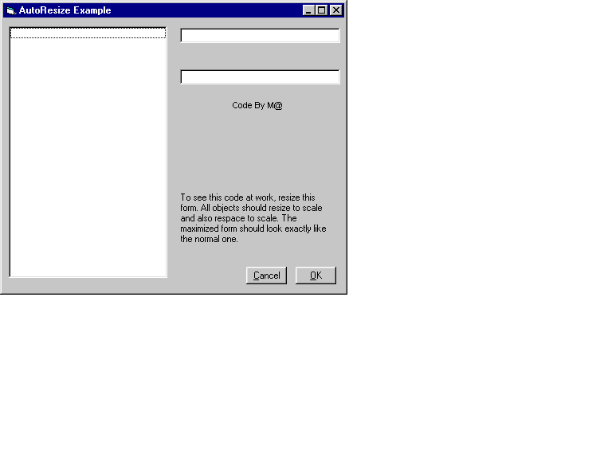



## Auto Form Resize

### Description

Automatically rescales a form to keep the layout identical at any size. For those of you out there who lock your forms to a certain size because rescaling is such a pain, give this a try...you will love it! NOTE: Although this code works as is, it is JUST AN EXAMPLE. You should be able to take the same logic and apply it to all of your forms, but please note that this example does not handle every type of control. For special controls (dbGrid, etc.) you will have to write a little code yourself to make it work.
 
### More Info
 
This is a sample form & module. You will need to paste the code into your forms & a module.

None (that I know of)

             |
---                |---
**Submitted On**   |2000-06-22 12:39:08
**By**             |[Matthew Roberts](https://github.com/Planet-Source-Code/PSCIndex/blob/master/ByAuthor/matthew-roberts.md)
**Level**          |Intermediate
**User Rating**    |4.7 (70 globes from 15 users)
**Compatibility**  |VB 5\.0, VB 6\.0
**Category**       |[Miscellaneous](https://github.com/Planet-Source-Code/PSCIndex/blob/master/ByCategory/miscellaneous__1-1.md)
**World**          |[Visual Basic](https://github.com/Planet-Source-Code/PSCIndex/blob/master/ByWorld/visual-basic.md)
**Archive File**   |[CODE\_UPLOAD69956222000\.zip](https://github.com/Planet-Source-Code/matthew-roberts-auto-form-resize__1-9135/archive/master.zip)

